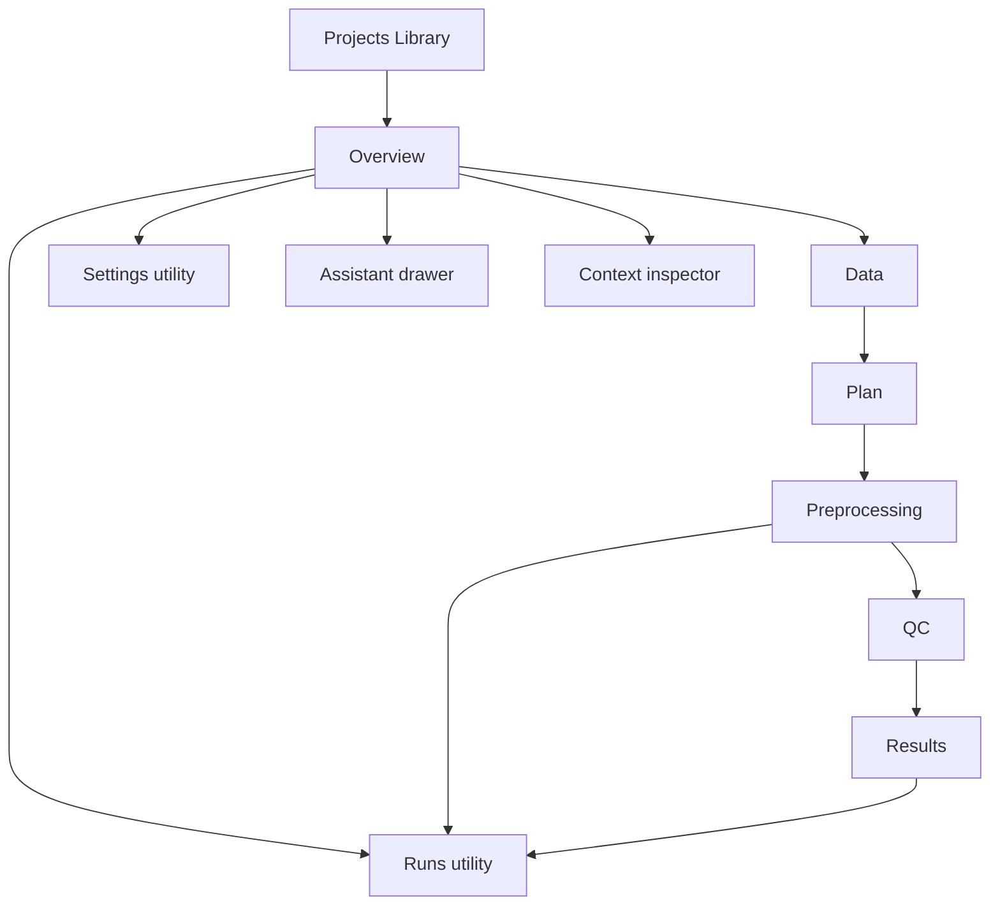

# MedImage Agent 前端重构实施计划

> 状态：Ready for Implementation
>
> 日期：2026-07-12
>
> 任务模式：Architecture and Refactor Mode
>
> 设计输入：`medimage-agent-ui-design/`
> 实施目标：在不改变后端执行语义、安全门控和科学状态真实性的前提下，将当前前端重构为设计稿定义的“桌面科研工作站”体验。

## 1. 范围锚点

### 1.1 目标

把设计稿中的 Projects、Overview、Data、Plan、Preprocessing、QC、Results、Runs 八个页面，转化为当前 React + TypeScript + Vite + Electron 前端中的真实、可测试、可访问、离线可用的工作区；保留现有后端 API、Approval Gate、任务流、科学证据状态和 Electron 边界。

### 1.2 必须完成

- 采用设计稿的视觉方向：安静、克制、科学、桌面优先、中等信息密度、低动效。
- 默认使用英文界面，并提供 English / 简体中文的运行时切换选项。
- 最低受支持桌面宽度为 1024px；1024px 及以上不得出现关键操作被遮挡或不可达。
- 建立统一标题栏、项目上下文、生命周期导航、内容容器、系统消息、运行活动条和工具抽屉。
- 新增真正独立的 Overview 工作区。
- 将 Runs 和 Settings 保留为项目工具入口，不丢失当前能力。
- 页面上每个状态、数量、进度、产物和科学能力等级都必须来自后端证据或明确的空状态。
- 保留 HTTP API 和批准的 Electron bridge；前端不得直接访问文件系统。
- 覆盖 loading、empty、disabled、blocked、partial、success、failure、offline 状态。
- 保持键盘操作、焦点管理、可读标签和 `prefers-reduced-motion` 支持。
- 每一阶段均有回归测试和可独立验收的用户流程。

### 1.3 不在本轮范围

- 不修改 Pipeline Runtime、node runner、科学内核、Approval Gate 或外部执行默认策略。
- 不新增“点击即执行”的真实 MATLAB/SPM、DPABI、DICOM 或 GPU 路径。
- 不把设计稿中的模拟数据、固定路径、固定版本、固定耗时或固定结果写入生产 UI。
- 不实现后端尚未支持的 preprocessing pause/cancel。
- 不把静态 HTML、浏览器版 Tailwind CDN 或 Lucide CDN直接复制进生产构建。
- 不以本次视觉重构顺带改变 API schema；发现契约缺口时拆成独立 Feature Bundle 任务。

### 1.4 总体验收标准

- [ ] 八个设计场景均有真实 React 页面或明确的项目工具入口。
- [ ] 首次启动默认显示英文；用户可切换简体中文，选择在重启后保持。
- [ ] 所有产品 UI 文案都有 `en` 和 `zh-CN` 条目，缺失翻译时安全回退到英文。
- [ ] 主生命周期固定为 Overview → Data → Plan → Preprocessing → QC → Results。
- [ ] Runs、Settings、Assistant、Inspector 保留且可从统一标题栏/上下文入口到达。
- [ ] 所有阻塞态都由 `projectWorkflow` 和后端证据决定，视觉禁用不能替代后端安全门。
- [ ] 静态设计中的硬编码项目、路径、版本、指标和进度全部被真实数据或空状态替换。
- [ ] 前端生产包不依赖外部 CDN，Electron 离线启动不因网络不可用而丢失样式或图标。
- [ ] 1024、1280、1440、1920px 四个桌面宽度完成布局验收。
- [ ] `App.tsx` 只保留应用组合职责，页面业务逻辑进入 feature controller/hook。
- [ ] 所有受影响测试通过，桌面构建与人工 GUI smoke 完成。

## 2. 证据摘要

| 事实 | 证据锚点 | 对计划的影响 |
|---|---|---|
| 设计明确为桌面科研工作站、低动效、中等密度 | `medimage-agent-ui-design/orchestration-summary.json:4` | 不采用营销站风格或高装饰性视觉 |
| 设计包含八个业务页面 | `medimage-agent-ui-design/orchestration-summary.json:37-45` | 页面迁移必须逐一建立验收映射 |
| Projects 设计为独立项目入口 | `medimage-agent-ui-design/pages/projects.html:422-546` | 项目库使用独立壳层，不显示项目生命周期 |
| Overview 设计包含生命周期、下一步和最近活动 | `medimage-agent-ui-design/pages/overview.html:443-572` | 当前通用 Overview Header 应拆成真实工作区 |
| Data 设计核心是数据源、转换计划和 DICOM series | `medimage-agent-ui-design/pages/data.html:486-654` | 复用现有 readiness、dry-run 和 series 模型 |
| Plan 设计同时呈现步骤、分析选项和审批提示 | `medimage-agent-ui-design/pages/plan.html:483-680` | 简洁配置层与现有技术审查台需要分层 |
| Preprocessing 设计呈现阶段和总体进度 | `medimage-agent-ui-design/pages/preprocessing.html:492-602` | 只显示真实 run/stage 事件；pause/cancel 暂不启用 |
| QC 设计突出 FD 摘要和 subject 指标 | `medimage-agent-ui-design/pages/qc.html:495-640` | 用现有 evidence-first 模型替换静态图表 |
| Results 设计组合 artifact list 和 NIfTI viewer | `medimage-agent-ui-design/pages/results.html:489-611` | 复用 ArtifactBrowser、image API 和 MedicalImageViewer |
| Runs 设计要求 history/detail/events/diagnostics/audit/logs | `medimage-agent-ui-design/pages/runs.html:478-616` | 现有 RunsWorkspace 能力保留并重新排版 |
| 当前壳层用布尔量切换 Projects，并用侧栏承载 lifecycle | `src/frontend/src/features/app/AppShellView.tsx:203-223,328-543` | 需要统一 workspace 导航模型，移除易分叉的布尔页面状态 |
| 当前 WorkflowTab 包含 runs/environment，但没有 overview | `src/frontend/src/lib/projectWorkflow.ts:5-31` | 引入 primary lifecycle 与 utility workspace 的明确分类 |
| 当前生命周期门控已有集中推导 | `src/frontend/src/lib/projectWorkflow.ts:34-149` | 必须复用并扩展，不能在页面内重新猜测状态 |
| 当前设计系统已有 token、暗色和 reduced-motion 基础 | `src/frontend/src/styles/tokens.css:1-145`, `src/frontend/src/styles/motion.css:1-35` | 增量收敛 token，不推倒重建 |
| 当前仍加载 1596 行 legacy `styles.css` | `src/frontend/src/main.tsx:4-8` | 样式迁移需分阶段，不能一次删除兼容层 |
| 当前 API 已按领域拆分并使用共享 client | `src/frontend/src/lib/api/client.ts:7-90`, `PROJECT_STATE.md:50` | 新代码直接从领域 API 模块导入，逐步消除 `legacy.ts` |
| 当前完整 GUI E2E 尚未被证明 | `PROJECT_STATE.md:66-69,130-131` | 重构验收不得夸大为真实全流程科学验证 |

## 3. 对设计代码的理解与转译规则

### 3.1 应保留的设计语言

- 48px 深色集成标题栏，显示应用/项目上下文、版本和工具入口。
- 48px 生命周期带，使用 completed/current/available/blocked 状态。
- 浅灰应用背景、白色内容卡片、细边框、弱阴影、8–19px 圆角。
- 正文 14px、说明 12–13px、页面标题 26–32px；数值和路径使用等宽字体。
- 蓝色代表主要操作/当前状态，绿色代表已有证据的成功，橙色代表需审查，红色只用于真实失败。
- 动效限制为 120–180ms 的颜色、透明度和轻微位移，并支持 reduced motion。
- 每页只突出一个主要动作，其余技术功能进入次级区域或折叠模块。

### 3.2 不可直接复制的原型内容

- 八个 HTML 都通过外部 Tailwind/Lucide CDN 加载资源（例如 `projects.html:363-364`），不满足桌面离线要求。
- 多页使用固定 `1440×900` 容器（例如 `projects.html:422`），生产实现必须支持 1024px–1920px 桌面宽度和纵向滚动。
- 原型前 400 行包含 Pinguo 消费产品组件样例和重复全局 `body/.card/.row` 规则，这部分不是 MedImage 业务 UI。
- 原型只有静态内容和 hover handler，没有真实路由、请求、错误处理或状态恢复。
- `plan.html` 的项目名和版本与其他页面不一致；生产版本必须来自 `/health.version`，项目名必须来自 ProjectStore 响应。
- 图标目录只提供 41 个图标，但页面引用了 `settings.svg`、`plus.svg`、`search.svg` 等未随目录提供的文件；实施时必须使用仓库内可验证的 SVG 组件集。

### 3.3 页面信息架构决策



- Primary lifecycle：`overview | data | plan | preprocessing | qc | results`。
- Utility workspaces：`runs | settings`；不伪装成科学流程阶段。
- Overlay tools：`assistant | inspector | create-project`；不作为工作区状态。
- Projects Library 是全局页面；选中项目后进入 Overview。
- URL 路由暂不引入新依赖；先用一个判别联合 `AppLocation` 管理桌面内部导航，避免 `projectsPageOpen + activeWorkflow` 的非法组合。

### 3.4 中英文切换决策

- 支持 locale：`en`、`zh-CN`；首次启动固定为 `en`，不根据操作系统语言自动改变默认值。
- 使用仓库内的类型化 message catalog 和 React context，不新增运行时国际化依赖。
- 建议目录：`src/frontend/src/i18n/messages/en.ts`、`zh-CN.ts`、`I18nProvider.tsx`、`useI18n.ts`、`format.ts`。
- `en` 是 key/type 的权威目录；`zh-CN` 必须满足相同的 TypeScript key 结构，构建时发现缺失 key 即失败。
- locale 由 `useAppState` 持久化；Settings 提供完整选择器，标题栏可提供当前语言的快捷入口。
- 使用 `Intl.NumberFormat`、`Intl.DateTimeFormat` 和 `Intl.RelativeTimeFormat` 做数字、日期、相对时间本地化。
- 项目名、subject ID、文件路径、日志、audit/provenance、算法 ID、单位和后端原始错误不得机器翻译；已知状态枚举通过 message key 映射，原始错误使用本地化标题加原文详情。
- UI 测试不得依赖脆弱的英文文本作为唯一定位；优先 role、accessible name 和稳定语义，语言专项测试分别断言两种 locale。

## 4. 目标前端架构

### 4.1 状态与职责

```text
App.tsx
  -> useAppController            全局健康、通知、工具抽屉
  -> useProjectController        项目选择、项目详情、inventory
  -> useTaskController           task、events、diagnostics、stream
  -> useWorkspaceNavigation      AppLocation、返回、默认入口、门控
  -> AppShellView                只做组合与懒加载
       -> WorkstationShell
          -> IntegratedTitleBar
          -> LifecycleRail
          -> SystemMessageRegion
          -> WorkspaceOutlet
          -> RunActivityBar
          -> AssistantSheet / ContextInspector
```

### 4.2 新的导航模型

建议在 `src/frontend/src/features/navigation/workspaceModel.ts` 定义：

```ts
type PrimaryWorkspace = "overview" | "data" | "plan" | "preprocessing" | "qc" | "results";
type UtilityWorkspace = "runs" | "settings";
type ProjectWorkspace = PrimaryWorkspace | UtilityWorkspace;

type AppLocation =
  | { kind: "projects" }
  | { kind: "project"; projectId: string; workspace: ProjectWorkspace };
```

门控依旧由 `projectWorkflow.ts` 的纯函数提供。`overview` 永远可达；Data 根据数据状态显示 current/completed；Plan、Preprocessing、QC、Results 根据真实数据和 run evidence 进入 available/current/completed/blocked。Runs/Settings 永远不影响主生命周期完成度。

### 4.3 数据访问边界

- 页面和 hook 只能从 `lib/api/<domain>.ts` 调用后端。
- 新代码禁止从 `lib/api/legacy.ts` 导入。
- 旧面板在被当前阶段触及时迁移到相应领域模块；未触及面板不做无关清理。
- 所有异步页面统一使用 `{data, loading, error, reload}` 模式，并在 projectId 切换时取消/丢弃过期响应。
- WebSocket/轮询负责刷新，不得以本地计时器伪造任务进度。

## 5. 页面到真实能力的映射

| 页面 | 设计核心 | 当前可复用实现 | 真实数据源 | 首轮禁止伪造的内容 |
|---|---|---|---|---|
| Projects | 最近项目、创建、快速开始 | `ProjectsPage`, `ProjectCreateSheet`, `useProjects` | projects API、Electron directory picker | 固定 6 个项目、固定时间、无契约的 demo import |
| Overview | 下一步、关键指标、最近活动 | `ProjectOverviewHeader`, inventory、tasks | project/study overview、tasks、project runs | 固定 12 subjects、固定 4 runs、固定 15 min |
| Data | 数据源、DICOM series、conversion plan | `DataConversionWorkspace`, `DicomSeriesTable`, `ConversionStepper` | dicom/readiness/BIDS/dry-run APIs | 固定本地路径、静态 24 series |
| Plan | stages、analysis options、presets、approval | `PlanWorkspace`, `PlanReviewConsole`, preset API | reviewed plan、validation、tool catalog、approval | 预选全部算法、把 metadata-only 显示为 executable |
| Preprocessing | current stage、overall/stage progress、logs | `PreprocessingWorkspace`, reviewed flow、task stream | preprocessing run、tasks/events、native run status | 本地自增进度、可点击 Pause/Cancel |
| QC | FD、subject metrics、报告 | `QCReportsWorkspace`, QC panels | QC report、motion readiness、native artifacts | 无证据图表、用绿色表示未验证结果 |
| Results | artifact list、viewer、export/validate | `ResultsWorkspace`, `ArtifactBrowser`, `MedicalImageViewer` | artifact/image/report APIs | 占位 Medical Image Canvas、虚构 12×12 FC |
| Runs | run list/detail/events/diagnostics/audit/logs | `RunsWorkspace`, task APIs、project history APIs | tasks、events、diagnostics、audit package | 静态 completed 状态和静态日志 |
| Settings | 设计未单列但当前产品需要 | `SettingsEnvironmentWorkspace` | desktop/deployment/readiness APIs | UI 开关绕过 backend execution gate |

## 6. 分阶段实施台账

### Phase 0：基线冻结与视觉契约

目标：在改动前固定行为、设计 token 和关键用户流程。

任务：

1. 为当前 Projects、lifecycle、Data、Plan、Runs、viewer 建立 characterization tests。
2. 在 `styles/tokens.css` 中建立设计稿 token 对照表，保留现有 token 名的兼容别名。
3. 建立 1024、1280、1440、1920 宽度的布局验收清单；高度不固定为 900px。
4. 记录当前大文件拆分目标：`App.tsx`、`AppShellView.tsx`、`PlanWorkspace.tsx`、`PreprocessingWorkspace.tsx`、`QCReportsWorkspace.tsx`、`RunsWorkspace.tsx`。
5. 明确不支持的原型动作：pause、cancel、无来源 ETA、无契约 demo import。

Definition of Done：重构前测试全部通过，关键行为有测试保护，设计 token 和断点有书面契约。

### Phase 1：设计系统与基础组件

主要文件：

- 修改 `src/frontend/src/styles/tokens.css`
- 修改 `src/frontend/src/styles/globals.css`
- 修改 `src/frontend/src/styles/typography.css`
- 修改 `src/frontend/src/styles/motion.css`
- 修改 `src/frontend/src/components/ui/primitives.tsx`
- 修改 `src/frontend/src/components/ui/primitives.module.css`
- 新增 `src/frontend/src/components/ui/icons.tsx`
- 新增 `src/frontend/src/i18n/messages/en.ts`
- 新增 `src/frontend/src/i18n/messages/zh-CN.ts`
- 新增 `src/frontend/src/i18n/I18nProvider.tsx`
- 新增 `src/frontend/src/i18n/useI18n.ts`
- 新增 `src/frontend/src/i18n/format.ts`
- 扩展 `src/frontend/src/styles/__tests__/design-system-css.test.ts`

任务：

1. 将设计稿色阶映射到语义 token，不让页面直接使用 `--brand-500` 之类原始色。
2. 统一 Card、Button、IconButton、Badge、Table、SegmentedControl、Progress、Tabs、EmptyState、Skeleton。
3. 图标全部打包进源码；不得依赖 CDN，也不得直接从未跟踪设计目录运行时读取。
4. 保留 dark theme，但首轮视觉验收以 light theme 为准；暗色必须保持对比度和状态语义。
5. 消除全局 `button:hover` 对局部组件的不可控覆盖；交互样式进入 primitive variants。
6. 建立 focus-visible、disabled、aria-busy 和 reduced-motion 测试。
7. 建立类型化双语 catalog、英文 fallback、插值和 `Intl` 格式化基础设施。
8. 将 shell、导航、通用按钮、状态、空态和错误标题作为第一批翻译域；技术日志和用户数据保持原文。

Definition of Done：基础组件可表达设计稿所有常用控件，生产构建断网仍完整显示；切换 `en/zh-CN` 无需刷新，缺失 key 测试为零。

### Phase 2：统一壳层与导航状态

主要文件：

- 新增 `src/frontend/src/features/navigation/workspaceModel.ts`
- 新增 `src/frontend/src/features/navigation/LifecycleRail.tsx`
- 新增对应 CSS 与测试
- 重构 `src/frontend/src/layouts/AppShell/`
- 重构 `src/frontend/src/features/dashboard/TopBar.tsx`
- 重构 `src/frontend/src/features/app/AppShellView.tsx`
- 修改 `src/frontend/src/lib/projectWorkflow.ts`
- 修改相关 controller/tests

任务：

1. 用 `AppLocation` 替代 `projectsPageOpen + activeWorkflow`。
2. 建立设计稿 48px 集成标题栏：返回项目库、项目切换、后端健康、Runs、Settings、Assistant、Inspector。
3. 将左侧 `ProjectLifecycleSidebar` 替换为横向 `LifecycleRail`；窄宽度下允许横向滚动或紧凑模式，不换成不可读的多行网格。
4. primary lifecycle 不含 Runs/Settings；通过 utility action 访问。
5. 键盘支持 ArrowLeft/Right、Home/End，blocked item 不可进入但原因可读。
6. 系统消息和 RunActivityBar 保持可见，不因新壳层遮挡。
7. 项目切换时清理页面级选中项，保留用户主题偏好。
8. 将 locale 纳入持久化 app preference；首次无偏好时使用英文，切换项目不得重置语言。

Definition of Done：不存在非法页面组合；刷新/项目切换/返回项目库路径确定；现有安全阻塞逻辑不变。

### Phase 3：Projects 与 Overview

主要文件：

- 重构 `features/projects/ProjectsPage.tsx` 及 CSS/tests
- 重构 `features/projects/ProjectCreateSheet.tsx`
- 新增 `features/workspaces/OverviewWorkspace.tsx` 及 CSS/tests
- 把 `ProjectOverviewHeader` 的推导逻辑抽成纯 model
- 扩展 project/tasks API types（仅前端类型）

Projects 任务：

1. 采用三列卡片为 1440px 主视图，1280px 两列、窄桌面一列。
2. 保留当前搜索、筛选、删除确认、loading、error、empty 能力；设计稿没有展示的能力进入轻量工具栏，不删除。
3. New Project 继续走 Electron picker + project create API。
4. “Load Demo Dataset” 只有在确认真实契约后才启用；否则不呈现为可成功动作。

Overview 任务：

1. 展示项目名、modality、真实 subject/data state、recommended next step。
2. 从 tasks/project runs 派生 run totals、pass/warn/fail 和 recent activity。
3. 将 recommended action 绑定到真实可达工作区；blocked 时给出原因和安全下一步。
4. 不展示无法从后端推导的 ETA。

Definition of Done：选择项目默认进入 Overview；Overview 的每一个数字均可追溯到响应或明确显示 unavailable。

### Phase 4：Data 与 Plan

Data 任务：

1. 把当前 raw/converted/mixed 三套路径重排为“Data Source + DICOM Browser + Readiness rail”。
2. 复用 `DicomSeriesTable`，增加搜索、过滤、选中态和空态；保留 series 证据来源。
3. Generate Conversion Plan 只触发 dry-run/prepare，不触发真实转换。
4. 高风险执行与 release readiness 仍位于折叠技术区，并保留所有确认字段。
5. converted BIDS 项目显示 inventory/validation，不错误显示 raw DICOM UI。

Plan 任务：

1. 将页面分为 Preprocessing Steps、Analysis Options、Presets、Actions、Approval Gate。
2. 基础视图显示人可读参数摘要；详细 schema、风险节点、tool catalog、validation 进入 Inspector/Technical section。
3. Save Plan 必须持久化 reviewed plan；Dry Run 必须走现有 reviewed dry-run 契约。
4. SPM12/DPABI/Minimal preset 的可用性来自后端 preset/capability，不因按钮可见而声称可执行。
5. Group Summary 等未实现能力显示 unavailable，不显示普通未勾选状态。

Definition of Done：Data → Plan 的状态转移由后端证据驱动；保存、验证、审批、dry-run 的语义与现有实现一致。

### Phase 5：Preprocessing 与 Runs

Preprocessing 任务：

1. 将配置态、待审批态、运行态、部分成功态、失败态分成明确 view model。
2. Current Stage、Overall Progress、Subject Progress、Stage Progress 全部由 task/native run 响应计算。
3. View Logs 跳转/打开同一 run 的 Runs utility，并保留选中 run id。
4. Pause/Cancel 首轮不实现；若展示，必须 disabled 并说明 backend unsupported。
5. 保留 `PreprocessingReviewedFlow` 中的 reviewed plan、registered input、approval 和 artifact handoff。
6. 将超大组件拆为 controller + summary + stage list + config inspector + technical modules。

Runs 任务：

1. 两列布局实现 run list + detail，保留搜索、状态过滤、分页/渲染上限。
2. Detail tabs 保留 Events、Logs、Diagnostics、Artifacts、Audit；设计稿缺失的 Artifacts 不能删除。
3. 失败 run 首屏显示 failed node、证据、safe retry 条件；retry 仍受后端契约控制。
4. WebSocket 断线显示可恢复状态，不能把缓存任务显示为实时。

Definition of Done：running/failed/completed/partial 四类真实任务都有可理解视图；从 Preprocessing 到对应 Runs detail 一跳可达。

### Phase 6：QC 与 Results

QC 任务：

1. 把现有 1000+ 行 `QCReportsWorkspace` 拆为 `useQcEvidence`、overview model、summary cards、FD chart、subject table、technical modules。
2. 只在有 motion evidence 时绘制 FD；阈值、单位和来源必须显示。
3. Pass/Warn/Fail 由报告规则推导，unknown 不计入 pass。
4. export/validate 按钮显示真实 loading/error/result；metadata-only 保持显式标签。
5. 保留 normalization/filtering/ALFF/ReHo/FC 等专业模块，但默认进入次级区域。

Results 任务：

1. 左侧 artifact list 与右侧 viewer 建立选中上下文；artifact 切换同步 subject/sequence/plane。
2. MedicalImageViewer 继续只通过 image preview API 取图，不直接读文件。
3. computed/validated/preview/metadata-only/unavailable 使用不同 EvidenceBadge，不靠文件名猜测。
4. Export Report Package 和 Validate 保留后端返回路径、校验状态和错误信息。
5. FC matrix、ALFF、ReHo 等只有实际 artifact 存在时才出现在列表。

Definition of Done：QC 和 Results 不再展示无证据的成功状态；viewer 的 loading/error/empty/unsupported 清晰可测。

### Phase 7：Settings、工具抽屉和遗留层收敛

任务：

1. Settings 从 lifecycle 移到标题栏 utility，保留 backend-owned 安全策略说明。
2. 在 Settings 提供 English / 简体中文选择器，并在标题栏显示可访问的快捷切换入口。
3. Assistant 与 Inspector 继续作为 overlay；验证焦点陷阱、Esc 关闭和返回焦点。
4. 完成八个场景及其 loading/empty/blocked/error 文案的双语迁移，并执行硬编码用户文案扫描。
5. 将本轮触及组件从 `lib/api/legacy.ts` 迁移到领域 API 模块。
6. 将 `styles.css` 中已被 modules/tokens 替代的规则分批删除；每批都有 selector 使用检查。
7. 拆分 `App.tsx` 重复状态和 controller 重叠，目标是 App 只做 hook 组合与 props wiring。
8. 去除硬编码 `v0.6`，显示 `/health.version`；离线时显示 package fallback 并标注连接状态。
9. 检查 bundle 分包；对 DPABI、技术诊断、报告等重模块使用 workspace/section 级 lazy loading。

Definition of Done：新代码无 legacy API 导入；样式兼容层明显缩小；核心首屏不加载所有技术模块；所有用户可见产品文案可在 English / 简体中文间完整切换。

### Phase 8：全链验收与桌面切换

任务：

1. 运行全部前端静态检查、测试、构建。
2. 运行受影响 backend API contract tests，确认前端未依赖不存在字段。
3. 在 1024/1280/1440/1920 宽度检查八个场景。
4. 对上述四个宽度分别执行 `en` 与 `zh-CN` 检查，覆盖中文文案增长、表格标题和按钮宽度。
5. 使用 keyboard-only、reduced-motion、dark theme、backend offline、empty project、raw DICOM、converted BIDS、active run、failed run、partial scientific output 做矩阵 smoke。
6. 运行 Electron dev smoke、unpacked build 和人工 GUI 流程。
7. 删除仅用于迁移的适配器和死代码；不删除跟踪资源或用户数据。
8. 更新架构文档与用户指南；不把计划文档当完成报告长期重复维护。

Definition of Done：所有验收矩阵通过；无法验证的真实 SPM/DPABI/GPU/real-data 路径在报告中明确列出。

## 7. Blast Radius Map

### 7.1 高影响面

| 区域 | 原因 | 风险 |
|---|---|---|
| `App.tsx` / `AppShellView.tsx` | 全局状态组合和页面选择 | 高 |
| `lib/projectWorkflow.ts` | 生命周期状态与默认路由 | 高 |
| `layouts/AppShell/` | 所有页面布局 | 高 |
| `features/workspaces/*` | 八个主要场景 | 高 |
| `styles/tokens.css` / primitives | 全局视觉与交互 | 高 |
| `useProjectController` / task controller | 项目切换与异步数据 | 中高 |

### 7.2 中影响面

| 区域 | 原因 | 风险 |
|---|---|---|
| `lib/api/*` | 领域导入迁移和类型收敛 | 中 |
| `components/domain/*` | Evidence/Technical 分层 | 中 |
| Electron shell | 标题栏高度、离线资源、窗口 smoke | 中 |
| docs | 新信息架构与用户路径 | 低 |

### 7.3 明确解耦面

- scientific kernels、runtime runners、artifact persistence、Approval Gate 不因纯前端重构改变。
- backend schema 首轮保持不变；缺口用独立任务处理。
- rawdata、DICOM、BIDS、NIfTI 用户数据不进入前端构建和测试 fixture。

## 8. 风险与缓解

| H-ID | 风险 | 缓解 | 验证 |
|---|---|---|---|
| H-01 | 静态设计被误当真实功能 | 建立页面-API-状态矩阵，所有 mock 文案删除 | fixture 为空时不得出现固定指标 |
| H-02 | UI 解锁但 backend gate 仍阻塞，用户误解 | visibility 与 execution authority 分离，显示 gate reason | blocked/403/409 contract tests |
| H-03 | lifecycle 状态在多个组件重复推导 | 集中到纯 `projectWorkflow`/workspace model | 单元测试覆盖状态矩阵 |
| H-04 | 项目快速切换导致旧响应污染新页面 | AbortController 或 request generation guard | 快速切换异步测试 |
| H-05 | 新壳层丢失 Runs/Settings/Assistant/Inspector | utility/overlay 明确建模 | 可达性测试和键盘 smoke |
| H-06 | 复制 CDN/Tailwind 导致 Electron 离线失效 | 本地 CSS modules、tokens、SVG components | 断网 production smoke |
| H-07 | 固定 1440×900 在小屏截断 | minmax/grid/scroll 容器和断点契约 | 四宽度视觉检查 |
| H-08 | 大组件一次重写引发回归 | characterization tests + 分阶段抽取，不改业务语义 | 每阶段完整 frontend suite |
| H-09 | scientific status 被颜色/文案夸大 | EvidenceBadge 映射 capability truth level | metadata-only/preview/partial tests |
| H-10 | Pause/Cancel 等原型动作无后端能力 | 首轮禁用或不显示，独立后端任务后再启用 | DOM 中无可用 unsupported action |
| H-11 | legacy CSS 与新 token 冲突 | primitive scope、逐批删除、CSS contract tests | selector 和 computed-style tests |
| H-12 | bundle 已较大且重构继续膨胀 | workspace lazy loading、技术面板延迟加载 | build size budget 与 chunk inventory |
| H-13 | 无障碍在自定义导航/图表中退化 | 语义元素、aria、键盘、文本表格 fallback | Testing Library + keyboard smoke |
| H-14 | 版本硬编码产生不一致 | 读取 `/health.version`，package 仅作 offline fallback | version surface test |
| H-15 | 设计资产未跟踪或引用缺失图标 | 只推广已核验 SVG/自建 inline icon，不运行时引用设计目录 | asset inventory test |
| H-16 | 全 GUI E2E 被错误宣称已验证 | 区分 build、launch、GUI smoke、real-data workflow | Completion Report 明确限制 |
| H-17 | 双语迁移不完整导致中英混排、key 泄漏或布局溢出 | 类型化 catalog、英文 fallback、硬编码文案扫描、双 locale 视觉矩阵 | catalog parity tests + 1024px 中文 smoke |

## 9. 测试与验证计划

### 9.1 自动测试

| 层级 | 新增/扩展内容 |
|---|---|
| Pure model | AppLocation、lifecycle matrix、default route、recommended action、evidence mapping |
| UI primitives | variants、focus、disabled、progress、tabs、icons、dark/reduced motion contract |
| i18n | catalog key parity、英文默认、中文切换、持久化、fallback、数字/日期格式化 |
| Shell | Projects/project workspace 切换、utility、overlay、系统消息、键盘导航 |
| Workspace | 八个页面的 loading/empty/blocked/success/partial/failure |
| API contract | 请求路径、payload、错误传播、取消过期响应 |
| Integration | Projects → Overview → Data → Plan；Preprocessing → Runs；QC → Results |
| Source contract | 无 CDN、无设计目录运行时引用、新代码无 `lib/api/legacy`、无硬编码版本 |

### 9.2 每阶段最低命令

```powershell
npm.cmd --prefix src/frontend run format:check
npm.cmd --prefix src/frontend run lint
npm.cmd --prefix src/frontend run typecheck
npm.cmd --prefix src/frontend run test
npm.cmd --prefix src/frontend run build
```

涉及 API wrapper/contract 时追加：

```powershell
python -m pytest <focused-backend-contract-tests> --tb=short --basetemp=.pytest_tmp
```

最终阶段追加 Electron/package 命令，按 `docs/桌面与前端/桌面应用打包.md` 执行，并分别报告 build、launch、GUI smoke、workflow smoke。

### 9.3 人工场景矩阵

1. Backend offline：可重试、可复制诊断、不可显示假数据。
2. 无项目：Projects empty 与 Create Project 可用。
3. Empty project：Overview/Data 可达，后续阶段明确 blocked。
4. Raw DICOM：dry-run 可达，preprocessing/QC/results 不可误入。
5. Converted BIDS：plan/preprocessing 可达，数据证据正确。
6. Active run：自动默认/提示进入 Runs 或 Preprocessing，进度来自事件。
7. Failed run：diagnostics、logs、audit 和 safe retry 信息可见。
8. Partial scientific output：Results/QC 明确 partial/preview，不显示 validated。
9. Keyboard only：主导航、tabs、dialogs、drawers、tables 均可操作。
10. Electron offline：无 CDN 请求，图标/样式完整。
11. Locale：首次英文；切换中文即时生效；重启保持；路径、日志、subject ID 和科学单位不被翻译。

## 10. Proof Obligations

| 声明 | 验证方式 |
|---|---|
| Overview 新增后不会改变执行路径 | 检查只消费 read APIs 和导航 action |
| lifecycle 是单一真相来源 | 搜索页面内重复的 data/run gate 推导 |
| Runs/Settings 不参与主阶段完成度 | `workspaceModel` 和 lifecycle tests |
| 设计原型无运行时依赖 | 构建产物和源码搜索 `cdn.jsdelivr`, `unpkg`, `medimage-agent-ui-design` |
| UI 不直接读文件 | 搜索 Node fs、未批准 Electron IPC、file path fetch |
| 所有成功状态有证据 | 对 capability/evidence 映射做参数化测试 |
| 版本来自权威源 | `/health.version` 交互和 fallback test |
| Pause/Cancel 未被伪实现 | Preprocessing DOM 与 API wrapper 检查 |
| 项目切换无 stale state | 延迟响应集成测试 |
| 桌面布局可滚动且不固定 900px | CSS contract + 四宽度 smoke |
| 双语目录完整且英文为默认 | catalog parity、app-state persistence、first-launch tests |

## 11. 假设与待确认项

| A-ID | 假设 | 分类 | 处理 |
|---|---|---|---|
| A-01 | 设计稿是视觉与信息架构基准，不是可直接发布的实现 | VERIFIED | 由静态 HTML/CDN/mock 内容证明 |
| A-02 | 默认英文，同时支持 English / 简体中文切换 | VERIFIED USER DECISION | 用户于 2026-07-12 明确确认 |
| A-03 | 桌面优先，最低有效宽度 1024px | VERIFIED USER DECISION | 用户于 2026-07-12 明确确认 |
| A-08 | locale 选择持久化，首次固定英文，不自动跟随系统语言 | WORKER CONSENSUS | 保证用户决定的英文默认值稳定且可预测 |
| A-04 | 不引入 React Router | WORKER CONSENSUS | 当前桌面内部状态足够，减少重构变量 |
| A-05 | light theme 是首轮像素验收基准，dark theme 不退化 | IMPLICIT | 当前已有 theme preference |
| A-06 | Load Demo Dataset 不在无明确项目创建契约时启用 | CRITICAL | 避免把 synthetic quickstart 冒充用户项目 |
| A-07 | 设计资产可作为视觉参考，但只有推广到 tracked frontend 资产后才能使用 | CRITICAL | 避免构建依赖未跟踪目录 |

当前没有阻塞计划制定或实施的 RFI。A-02 与 A-03 已由维护者确认。

## 12. Git、制品与交付规则

- 使用单一 owner、单一 `codex/` 分支、一个阶段一个可审查 diff。
- 不运行 `git add .`；仅显式暂存该阶段文件。
- `medimage-agent-ui-design/` 作为设计输入，不直接整体纳入生产源码。
- 不提交 `src/frontend/dist/`、coverage、截图、浏览器 profile、SQLite、runtime outputs。
- 需要的 SVG 只复制经过核验的最小集合到 tracked frontend asset/component。
- 每阶段 Completion Report 必须列出 modified/created/deleted 文件、API/schema 影响、验证结果、风险和未验证路径。

## 13. 推荐任务拆分与顺序

| Task ID | 任务 | 模式 | 依赖 |
|---|---|---|---|
| FE-RF-00 | 基线与视觉契约 | Architecture and Refactor | 无 |
| FE-RF-01 | Token、primitive、icons、i18n foundation | Architecture and Refactor | FE-RF-00 |
| FE-RF-02 | AppLocation、壳层、LifecycleRail | Architecture and Refactor | FE-RF-01 |
| FE-RF-03 | Projects + Overview | Feature Bundle | FE-RF-02 |
| FE-RF-04 | Data + Plan | Feature Bundle | FE-RF-03 |
| FE-RF-05 | Preprocessing + Runs | Feature Bundle | FE-RF-04 |
| FE-RF-06 | QC + Results + viewer | Feature Bundle | FE-RF-05 |
| FE-RF-07 | Settings/tools/legacy cleanup | Architecture and Refactor | FE-RF-06 |
| FE-RF-08 | Electron、响应式、全链验收 | Release and Packaging | FE-RF-07 |

不要并行让多个实现 agent 修改同一工作区；页面 bundle 可以在前一个阶段合并并通过全套测试后再继续。

## 14. 停止条件

出现以下任一情况时停止当前实现任务并升级：

- 需要改变 backend request/response schema 才能表达设计状态。
- 需要新增 pause/cancel、真实 demo import 或外部执行路径。
- 需要修改 Approval Gate、runtime、artifact persistence 或 path safety。
- 现有测试表明设计动作与当前安全语义冲突。
- 发现用户未提交的重叠前端改动，无法安全合并。
- Electron 离线资源需要新增未经确认的第三方许可证。

## 15. 当前基线验证记录

2026-07-12 在未修改生产代码的情况下执行：

- `npm.cmd --prefix src/frontend run typecheck`：通过。
- `npm.cmd --prefix src/frontend run test`：40 个 test files、219 个 tests 全部通过。
- `npm.cmd --prefix src/frontend run build`：通过；Vite 转换 197 modules。

该记录只证明当前源代码基线可编译、测试和构建，不证明 Electron GUI、真实数据全流程、MATLAB/SPM、DPABI 或 GPU 执行。

---

## Handoff

Ready for Implementation。

- Hazards mitigated：16/16
- Planned delivery tasks：9
- Primary lifecycle workspaces：6
- Utility workspaces：2
- Design scenarios covered：8/8
